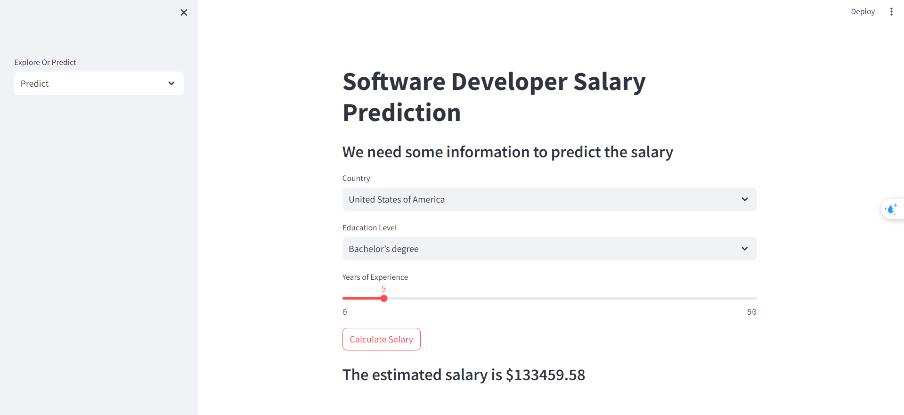
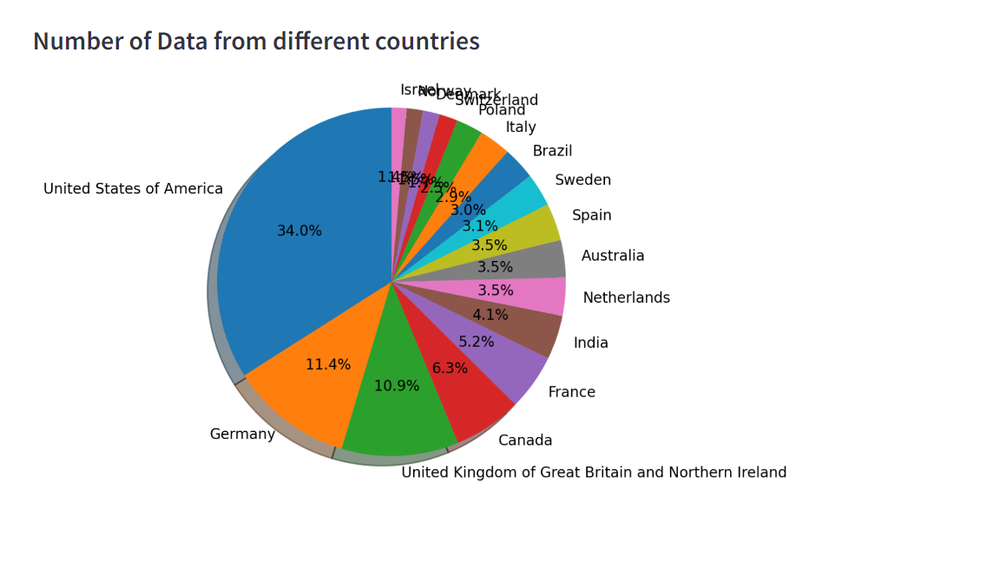
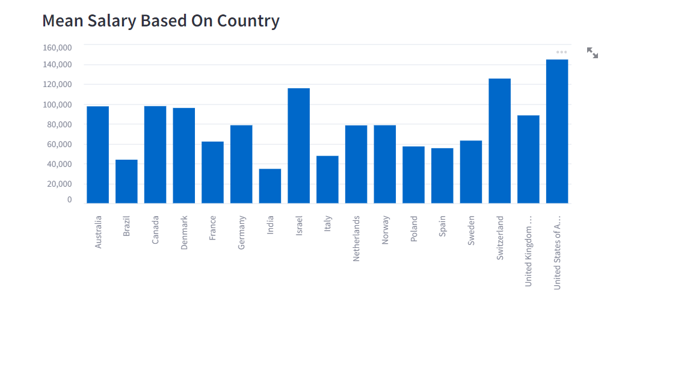
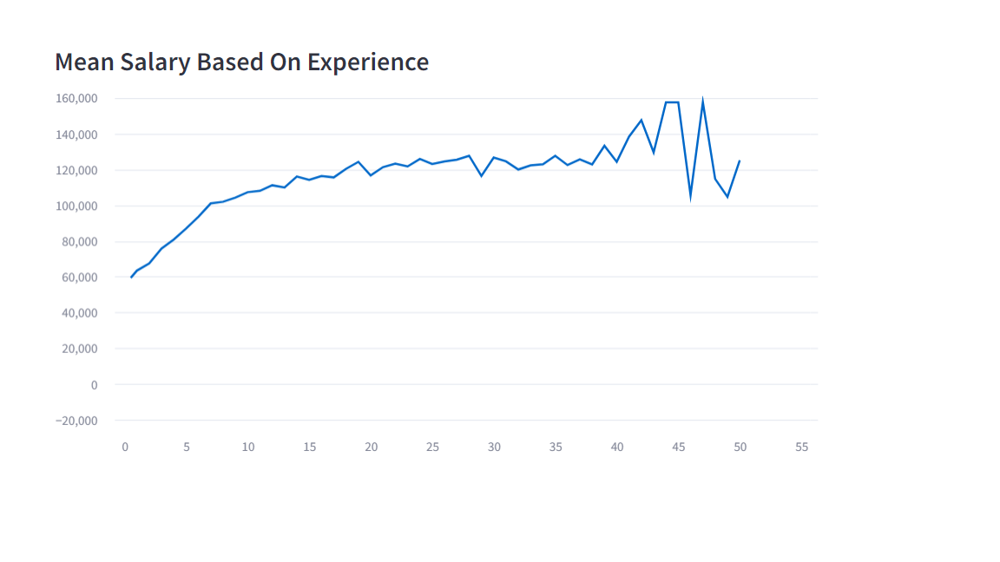

# Build A Salary Prediction Web App With Streamlit

Build a Machine Learning web application from scratch in Python with Streamlit. We use real world data to build a machine learning model. Firstly, we analyze the data and build our model, then we build the web app using streamlit.

## Stackoverflow Survey Data:
* https://survey.stackoverflow.co/2023  
* https://insights.stackoverflow.com/survey

## Prediction Example

## Number of Data from Different Countries

## Mean Salary Based On Country

## Mean Salary Based On Experience

## Create a virtual environment:
    python -m venv .venv

## To activate the virtual environment:
    .venv\Scripts\activate.bat

## Install the required libraries:
    pip install -r requirements.txt

## To run the app
    streamlit run app.py

